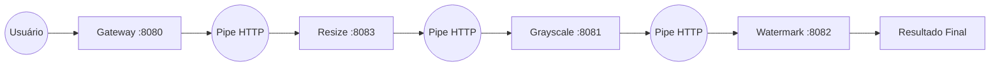

# 📸 InstaFilter - Arquitetura Pipes and Filters Resiliente

Este projeto é uma **Prova de Conceito (PoC)** de uma arquitetura distribuída para processamento de imagens baseada no estilo **Pipes and Filters**. O sistema simula um pipeline de transformação de imagens (Redimensionamento, Escala de Cinza e Marca D'água) com foco total em **Resiliência**, **Desacoplamento** e **Performance**.

## 🏗️ Arquitetura

O sistema implementa o padrão *Pipes and Filters* onde cada etapa do processamento é um microsserviço independente. Utilizamos uma estratégia de **Monorepo Lógico**, onde o mesmo código-fonte assume comportamentos diferentes baseados na configuração de inicialização.

### Fluxo de Dados



### 🧠 Decisões Arquiteturais (ADRs)

O projeto segue decisões documentadas formalmente para garantir robustez:

| ADR | Decisão | Descrição |
| :--- | :--- | :--- |
| **001** | **Pipes and Filters Distribuído** | Cada filtro roda isolado como um serviço, comunicando-se via HTTP, permitindo escalabilidade independente. |
| **002** | **Caching em Memória** | Uso de `ConcurrentHashMap` para evitar reprocessamento de imagens idênticas, otimizando o tempo de resposta. |
| **003** | **Resiliência (Circuit Breaker)** | Implementação de **Degradação Graciosa**. Se um filtro falhar, a imagem é retornada no estado atual processado até aquele ponto, em vez de gerar um erro fatal (HTTP 500). |

## 🚀 Tecnologias Utilizadas

- **Java 17+**
- **Spring Boot 3.x** (Web, Actuator)
- **Resilience4j** (Circuit Breaker para tolerância a falhas)
- **Maven**

## 🧩 Documentação Visual (C4 Model)

A arquitetura está documentada nos diagramas disponíveis na raiz do repositório:

- `Diagrama de Contexto.png`: Visão do usuário enviando imagens.
- `Diagrama de Contêiner.png`: Detalhamento dos 4 serviços Spring Boot.
- `Diagrama de Componente.png`: Detalhamento interno (Controller, Service/Cache, Pipe/Circuit Breaker).
- `Diagrama de Código.png`: Estrutura de classes.

---

## ⚙️ Como Executar (Simulação de Cluster)

Para subir a infraestrutura completa, você precisará de **4 terminais** abertos simultaneamente. Execute os comandos abaixo na ordem sugerida:

### 1. Serviço de Resize (Filtro 1)
Responsável pelo redimensionamento da imagem.
```bash
mvn spring-boot:run -Dspring-boot.run.arguments="--server.port=8083 --app.role=RESIZE"
```

### 2. Serviço de Grayscale (Filtro 2)
Aplica o filtro de escala de cinza.
```bash
mvn spring-boot:run -Dspring-boot.run.arguments="--server.port=8081 --app.role=GRAYSCALE"
```

### 3. Serviço de Watermark (Filtro 3)
Adiciona a marca d'água.
```bash
mvn spring-boot:run -Dspring-boot.run.arguments="--server.port=8082 --app.role=WATERMARK"
```

### 4. Gateway (Ponto de Entrada)
Recebe a requisição do usuário e inicia o pipeline.
```bash
mvn spring-boot:run -Dspring-boot.run.arguments="--server.port=8080 --app.role=GATEWAY"
```

---

## 🧪 Cenários de Teste

### 1. Caminho Feliz (Happy Path)
Faça uma requisição para o Gateway. A primeira vez levará alguns segundos (simulação de processamento).

```bash
curl "http://localhost:8080/api/upload?imagem=minha_foto.jpg"
```
> **Resposta esperada:** `URL_FINAL/processado_WATERMARK_processado_GRAYSCALE_processado_RESIZE_minha_foto.jpg`

### 2. Testando o Cache (ADR 002)
Execute o mesmo comando acima novamente.
> **Resposta esperada:** Retorno imediato (milissegundos) e log no console do Gateway: `⚡ [CACHE HIT]`.

### 3. Testando a Resiliência (ADR 003)
Para validar o Circuit Breaker e a Degradação Graciosa:

1. Pare o terminal do serviço **Watermark** (Porta 8082).
2. Faça a requisição novamente no Gateway algumas vezes (3 a 4 vezes para abrir o circuito).
3. Observe a resposta.

> **Resposta esperada:** `URL_FINAL/processado_GRAYSCALE_processado_RESIZE_minha_foto.jpg_SemWaterMark_(CIRCUITO_ABERTO)`

O sistema **não falha**. Ele entrega a imagem processada até onde foi possível (Grayscale), informando que a etapa de Watermark foi pulada.
